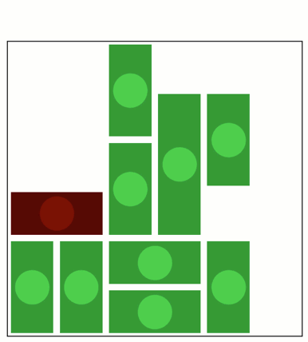

RushHour: dragging with algorithmically specified constraints
-------------------------------------------------------------

**Create a GUI for the RushHour game.**

-  **Features:**

   -  Graphics-driven assignments
   -  Validate legal dragging by calling a function that raises an
      exception on illegal values.

-  **Try me:**

   -  Try dragging the cars to let the red car pass through.

.. code:: python

    from pyquibbler import iquib, initialize_quibbler, q, quiby
    initialize_quibbler()
    import matplotlib.pyplot as plt
    import numpy as np
    from matplotlib.patches import Rectangle
    %matplotlib osx

.. code:: python

    # Board parameters:
    l = 6  # size of the board
    d = 3  # number of car steps per square
    spc = 0.2  # space betweek cars
    
    # initial car configuration:
    xv = np.array([2, 0, 1, 0, 1, 2, 2, 3, 4, 4]) * d
    yv = np.array([0, 2, 2, 0, 0, 2, 4, 2, 0, 3]) * d
    dxv = np.array([1, 1, 1, 1, 1, 1, 1, 1, 1, 1]) * d
    dyv = np.array([-2, -2, -2, 2, 2, 2, 2, 3, 2, 2]) * d  # pos/neg for vertical/horizontal cars
    
    yv = iquib(yv)
    
    # prepare figure:
    plt.figure(0)
    plt.clf()
    ax = plt.gca()
    ax.axis(np.array([-0.5, l - 0.5, -0.5, l - 0.5]) * d)
    ax.axis('square')
    plt.setp(ax, xticks=[], yticks=[])
    
    # Draw cars:
    clr = np.array([0.4, 0, 0])
    for x, y, dx, dy in zip(xv, yv, dxv, dyv):
        if dy < 0:
            x, y, dx, dy = y, x, -dy, dx
        rect = Rectangle(xy=(x - d/2 + spc, y - d/2 + spc), 
                         width=dx - 2*spc, height=dy - 2*spc, 
                         facecolor=0.7 * clr)
        ax.add_patch(rect)
        plt.plot(x - d/2 + dx/2, y - d/2 + dy/2, 'o', 
                 color=clr, markersize=30, pickradius=30)
        clr = np.array([0.2, 0.8, 0.2])

.. code:: python

    # Raise exception on illegal car position
    # This will prevent dragging cars on top of each other
    @quiby(is_graphics=True)
    def check_valid(xx, yy, dxx, dyy):
        print('x')
        z = np.zeros((l*d, l*d), dtype=np.int8)
        for x, y, dx, dy in zip(xx, yy, dxx, dyy):
            if dy < 0:
                x, y, dx, dy = y, x, -dy, dx
            if x < 0 or y < 0 or x + dx > l*d or y + dy > l*d:
                raise Exception('out of range')
            z[x:x+dx, y:y+dy] += 1
        
        if np.any(z>1):
            print('raising')
            raise Exception('overlap')
        
        if yy[0] == 4 * d:
            ax.set_title('Yeh!', fontsize=24)
    
    check = check_valid(xv, yv, dxv, dyv);

.. code:: none

    x

